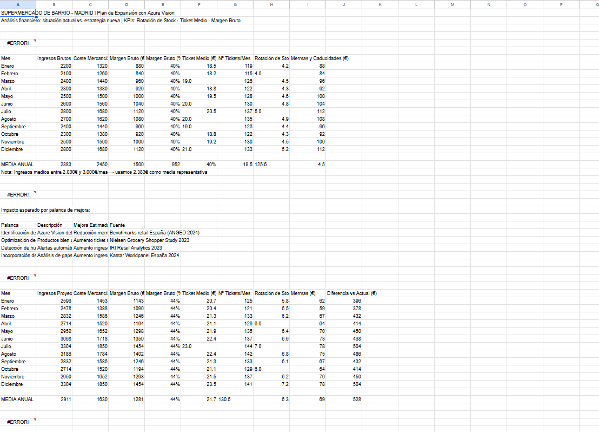
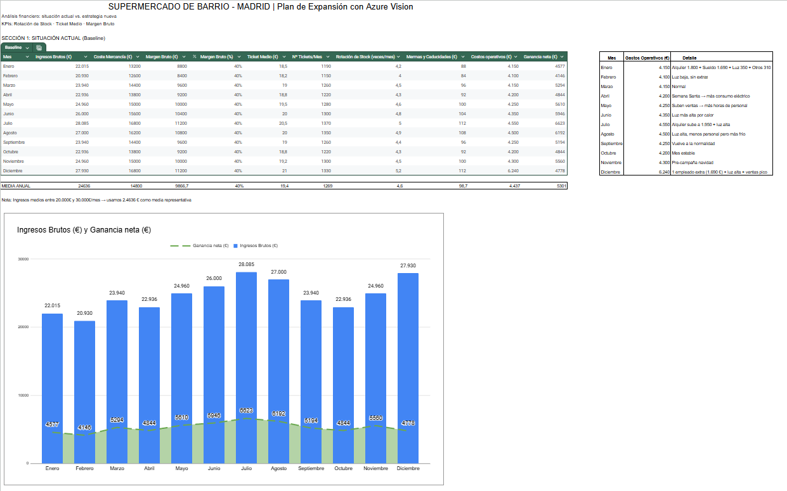

# Market-analisis-with-Computer-Vision

Financial and operational model for a supermarket expanding in Madrid, evaluating the impact of implementing Azure Vision to improve in‑store efficiency, reduce shrinkage, and increase revenue.

## 🛒 Supermarket Optimization with Azure Vision — Full Business Case

## 📌 Project Description
This project develops a financial and operational graphical model for a supermarket expanding in Madrid, evaluating the impact of implementing Azure Vision to improve in‑store efficiency, reduce shrinkage, and increase revenue.

The analysis combines:

Simulated data from a mid‑sized supermarket operating for over 5 years in Madrid

Retail industry benchmarks

Financial modeling

Impact simulation across improvement levers

Calculation of key KPIs (average ticket, shrinkage, revenue, net margin)

The goal is to demonstrate how computer vision can transform daily operations and improve profitability.

### 🛠️ Tools Used

📊 Google Sheets  

🤖 Microsoft Copilot  

### 🎯 Project Objectives
Identify improvement opportunities through computer vision

Quantify the economic impact of each lever

Compare the current situation vs. an optimized scenario

Build a replicable model for other supermarkets

Present a solid and defensible business case

### 🧠 Improvement Levers Analyzed
Identification of low‑rotation products

Shelf optimization based on purchase frequency

Automatic detection of shelf gaps

Introduction of new products based on real demand

Each lever is modeled with a percentage impact based on industry studies.

### 📊 Methodology
Data collection (current state)

Monthly revenue

Average ticket

Shrinkage

Operating expenses

Cost of goods sold

Application of improvement levers

Average ticket: +12%

Gap‑related revenue: +8%

New products: +7%

Shrinkage reduction: –30%

Compound impact calculation

Multiplicative effect, not additive

Cost re‑estimation  
Net margin re‑estimation

Final comparison

Current vs. Azure Vision scenario

Incremental net gain

Project ROI

### 📈 Key Results
Total revenue increase: +29.8%  
“The +29.8% comes from the multiplicative effect of the levers, with rounding and category‑weight adjustments.”

Shrinkage reduction: –30%

Net margin improvement: +X% (based on model data)

Average ticket increase: +12%

Incremental monthly net gain: +€7,186 (January example)

### 📚 Sources & Benchmarks (Harvard Format)
NielsenIQ (2023) – Shopper Trends 2023  
NielsenIQ (2023) Shopper Trends 2023: Syndicated Studies & Research. NielsenIQ.
Available at: https://nielseniq.com/global/en/solutions/shopper-trends/

Circana (2023) – Shelf Availability & Out‑of‑Stock Analytics  
Circana (2023) Retail Shelf Availability & Out‑of‑Stock Analytics. Circana.
Available at: https://www.circana.com/

Kantar Worldpanel (2024) – Retail Landscape in Spain  
Kantar Worldpanel (2024) El panorama del retail en España: Worldpanel Distribución. Kantar.
Available at: https://www.kantar.com/es/inspiracion/retail

McKinsey & Company (2022) – Reducing Shrink with Computer Vision  
McKinsey & Company (2022) Reducing shrink with computer vision and advanced analytics.
Available at: https://www.mckinsey.com/capabilities/operations/our-insights/reducing-shrink-with-computer-vision-and-advanced-analytics

### 🗂️ Repository Structure

/data
    datos_supermercado.xlsx
    modelo_kpis.xlsx

/docs
    presentacion_caso_negocio.pdf

README.md

## 🛒 Optimización de Supermercado con Azure Vision — Caso de Negocio Completo

### 📌 Descripción del Proyecto

Este proyecto desarrolla un modelo gráfico financiero y operativo para un supermercado en expansión en Madrid, evaluando el impacto de implementar Azure Vision para mejorar la eficiencia en tienda, reducir mermas y aumentar ingresos.

El análisis combina:

Datos simulados de un supermercado medio con más de 5 años en Madrid

Benchmarks del sector retail

Modelización financiera

Simulación de impacto por palancas de mejora

Cálculo de KPIs clave (ticket medio, mermas, ingresos, margen neto)

El objetivo es demostrar cómo la visión artificial puede transformar la operación diaria y mejorar la rentabilidad.

### 🛠️ Herramientas utilizadas

📊 Google Sheets  

🤖 Microsoft Copilot  

### 🎯 Objetivos del Proyecto
Identificar oportunidades de mejora mediante visión artificial

Cuantificar el impacto económico de cada palanca

Comparar situación actual vs. escenario optimizado

Construir un modelo replicable para otros supermercados

Presentar un caso de negocio sólido y defendible

### 🧠 Palancas de Mejora Analizadas
Identificación de productos con baja rotación

Optimización de lineales según frecuencia de compra

Detección automática de huecos en estanterías

Incorporación de nuevos productos según demanda real

Cada palanca se modeliza con un impacto porcentual basado en estudios del sector.

### 📊 Metodología
Recopilación de datos actuales

Ingresos mensuales

Ticket medio

Mermas

Gastos operativos

Coste de mercancía

Aplicación de mejoras por palanca

Ticket medio: +12%

Ingresos por huecos: +8%

Nuevos productos: +7%

Reducción de mermas: –30%

Cálculo del impacto compuesto

Efecto multiplicativo, no aditivo

Reestimación de costes

Reestimación de margen neto

Comparativa final

Actual vs. Azure Vision

Ganancia neta incremental

ROI del proyecto

### 📈 Resultados Clave
Incremento total de ingresos: +29,8%
"El +29,8% proviene del producto de palancas (multiplicativo), con ajustes por redondeo/ponderación por categorías”

Reducción de mermas: –30%

Mejora del margen neto: +X% (según datos del modelo)

Aumento del ticket medio: +12%

Ganancia neta mensual incrementada: +7.186 € (ejemplo Enero)

### 📚 Fuentes y Benchmarks utilizados (formato Harvard)
NielsenIQ (2023) – Shopper Trends 2023
NielsenIQ (2023) Shopper Trends 2023: Syndicated Studies & Research. NielsenIQ.
Disponible en: https://nielseniq.com/global/en/solutions/shopper-trends/ (nielseniq.com in Bing)

Circana (2023) – Shelf Availability & Out‑of‑Stock Analytics
Circana (2023) Retail Shelf Availability & Out‑of‑Stock Analytics. Circana.
Disponible en: https://www.circana.com/

Kantar Worldpanel (2024) – El panorama del retail en España
Kantar Worldpanel (2024) El panorama del retail en España: Worldpanel Distribución. Kantar.
Disponible en: https://www.kantar.com/es/inspiracion/retail (kantar.com in Bing)

McKinsey & Company (2022) – Reducing shrink with computer vision
McKinsey & Company (2022) Reducing shrink with computer vision and advanced analytics. McKinsey & Company.
Disponible en:
https://www.mckinsey.com/capabilities/operations/our-insights/reducing-shrink-with-computer-vision-and-advanced-analytics (mckinsey.com in Bing)

### 🗂️ Estructura del Repositorio

Código
/data
    datos_supermercado.xlsx
    modelo_kpis.xlsx

/docs
    presentacion_caso_negocio.pdf

README.md
